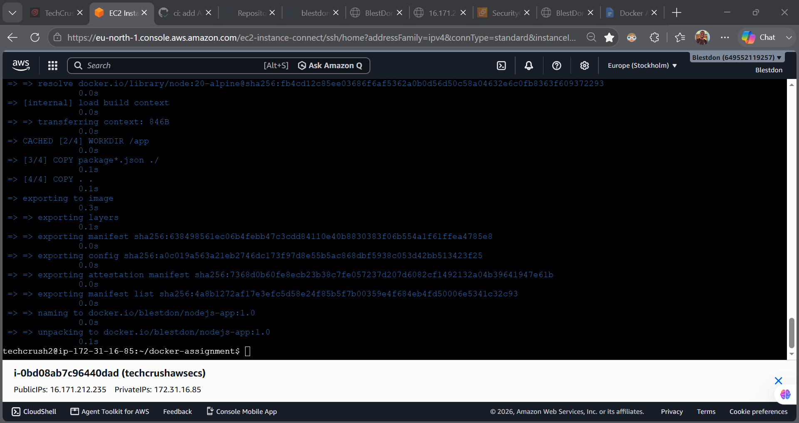
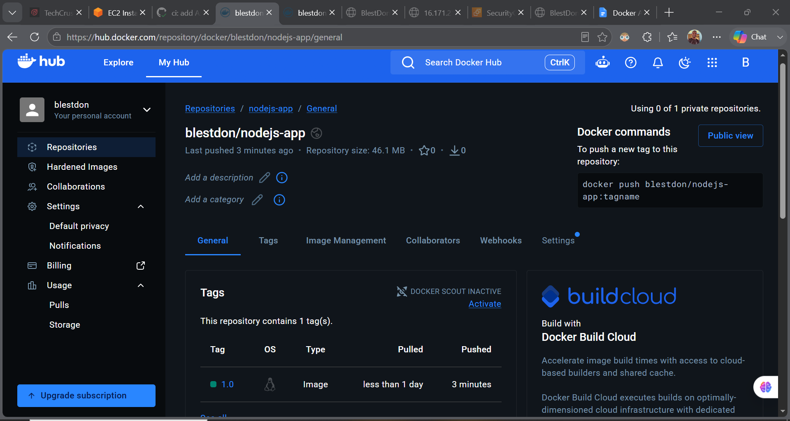
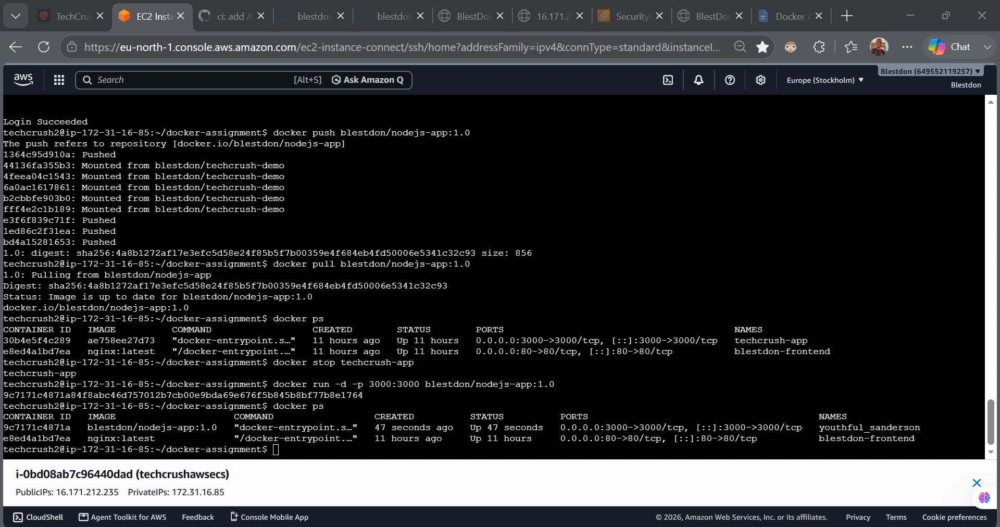
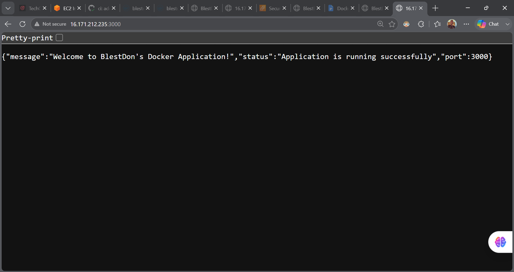

# Node.js & Docker Deployment Assignment

## Project Overview

This project demonstrates the deployment of a simple Node.js application using GitHub, Linux, Docker, and Docker Hub.

The application returns a JSON response confirming that the Node.js application is running successfully on port 3000.

## 1. Node.js Application

The application was created using Node.js and contains the following files:

- `app.js` - Main Node.js application
- `package.json` - Project configuration
- `Dockerfile` - Instructions for building the Docker image

## 2. GitHub Repository

The application was pushed to GitHub and cloned to the Linux server.

Repository:

https://github.com/blestdon-hub/docker-assignment

## 3. Docker Image Build

The Docker image was built using:

`docker build -t blestdon/nodejs-app:1.0 .`

The image was successfully built and tagged as:

`blestdon/nodejs-app:1.0`

### Screenshot 1 – Successful Docker Build

## 4. Docker Hub

The Docker image was pushed to Docker Hub with the tag:

`blestdon/nodejs-app:1.0`

### Screenshot 2 – Docker Hub Image and Tag

## 5. Running Docker Container

The Docker image was pulled from Docker Hub and run as a container.

The application was exposed on port 3000.

### Screenshot 3 – Running Docker Container

## 6. Live Application

The deployed Node.js application was accessed through the server's public IP address on port 3000.

The application returned a JSON response confirming that it was running successfully.

### Screenshot 4 – Live Application

## Conclusion

The Node.js application was successfully:

1. Created
2. Pushed to GitHub
3. Cloned to a Linux server
4. Containerized using Docker
5. Built into a Docker image
6. Pushed to Docker Hub
7. Pulled from Docker Hub
8. Run as a Docker container
9. Verified through the live application
